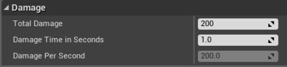

UE4完全投入c++的怀抱多少还是出乎意料的，毕竟现在讲究个快速开发，又因为App Store的审核机制使得脚本开发越发流行。很多人第一感觉用c++开发等同于开发慢，更新迭代更慢。为此，官方也用一篇博客解释了为什么。大体意思是使用了一些技术让c++具备了部分快速开发的能力，脚本未曾消失而是升华成更高级的可视化（Bluprint）编程了。


在UE4中用c++不难，可以把`unreal c++`看作加强版c++，它增加了很多特性让c++更易用。当然，本篇介绍肯定是针对具备编程语言使用经验的人群，毫无代码基础的，[Blueprint](https://docs.unrealengine.com/latest/INT/Engine/Blueprints/index.html)是更好的选择。

在UE4中写纯粹的老c++代码是可以的，但要完全利用起这款引擎，学习掌握unreal编程模型才是关键。

--------------------------------
##C++与Blueprints

UE提供两种方法创建游戏性元素：**C++**和**Blueprints可视化脚本**。使用C++的话，程序员用代码添加基本的游戏性系统，设计师接着依此向关卡或游戏定制游戏逻辑。如此，C++程序员在IDE（Visual Studio，Xcode）中工作，设计师在Unreal编辑器的Blueprint编辑器中工作。


引擎提供的API和框架类两种方法均可独立利用，但要完全发挥实力最好是结合使用。意味着最正宗的引擎使用姿势是由程序员拿C++创建游戏逻辑功能块，由设计师摆弄这些功能块创造有趣的游戏逻辑。所以常规的工作流是C++程序员为设计师创建游戏逻辑功能块。此时，我们创建一个可以导出到Blueprint的类，在类中，添上设计师可以自由设置获取的属性即可。至于怎么导出与交互，简单，引擎提供成熟的工具和C++宏。


下面简单演示一下这个工作流

---------------------------------------
###类向导

- 首先就是**创建一个类**。使用编译器里的类向导可以生成基本的C++类，之后会把该类导出到Blueprint中。如图，我们创建一个类继承Actor：


- 然后填上类名，创建并生成代码文件： 


之后，（自动／手动）打开代码文件，里面已经有一些自动生成的类定义相关代码。通过向导创建类与其他IDE没啥区别，相信老司机已经做完前戏迫不及待想要啪啪啪（写代码）了。


自动生成的代码咱也先别急着删，弄懂了这些才算明白UE4的编程模型。咱既然是在学习使用工具，还是好好看看说明书的好。拿着锯子当刀使，你说你你蠢还是锯子不好用？

```cpp
#include "GameFramework/Actor.h"
#include "MyActor.generated.h"

UCLASS()
class AMyActor : public AActor
{
    GENERATED_BODY()

public: 
    // Sets default values for this actor's properties
    AMyActor();
    // Called when the game starts or when spawned
    virtual void BeginPlay() override;

    // Called every frame
    virtual void Tick( float DeltaSeconds ) override;
};
```

自动生成的代码里有两个指明要重载的函数，**`BeginPlay()`**和**`Tick()`**。BeginPlay()作为事件触发，表明actor进入了游戏并处于激活状态，是为你的类进行初始化游戏逻辑的好地方。Tick()逐帧调用，可写上任何可循环的逻辑。当然，如果你根本不需要这两个玩意，那删了最好，还能省点性能。如果确定要删，不要忘了删掉构造器里那行用来决定tick是否发生的语句。代码如下：

```cpp
AMyActor::AMyActor()
{
    // Set this actor to call Tick() every frame.  You can turn this off to improve performance if you do not need it.
    
    PrimaryActorTick.bCanEverTick = true;
}
```

-------------------------
###让属性展示在编辑器中

创建类之后，再添加一些可供设计师在编辑器里设置的属性。暴露属性给编辑器非常简单，使用宏**`UPROPERTY()`**即可。要做的仅仅是把宏**`UPROPERTY(EditAnywhere)`**写在属性前面。

```cpp
UCLASS()
class AMyActor : public AActor
{
    GENERATED_BODY()

    UPROPERTY(EditAnywhere)
    int32 TotalDamage;

    ...
};
```

然后就可以在编辑器里直接编辑这个属性了。给宏**`UPROPERTY()`**传递更多的参数就可以控制属性在编辑器中的行为与展现。例如，我想让`TotalDamage`属性与它相关的属性呆在一块，就使用**分类**功能。如下所示：

```cpp
UPROPERTY(EditAnywhere, Category="Damage")
int32 TotalDamage;
```

当从编辑器里查看这个属性时，它就出现在`Damage`目录下，和其他声明同一个分类名的属性呆在一块。这样设计师设置属性时非常便利。

接着把属性暴露给Blueprint。

```cpp
UPROPERTY(EditAnywhere, BlueprintReadWrite, Category="Damage")
int32 TotalDamage;
```

看上面有个Blueprint专用的参数，让属性可供Blueprint读写。另一个`BlueprintReadOnly`参数适用于只读，在Blueprint中做常量。更多控制属性的参数就看[文档](https://docs.unrealengine.com/latest/INT/Programming/UnrealArchitecture/Reference/Properties/Specifiers/index.html)吧。


最后我们给类再加两个属性。已有一个actor总伤害，就再加一个伤害时间和每秒伤害值。前者可以由设计师设置，后者只能看不能改。

```cpp
UCLASS()
class AMyActor : public AActor
{
    GENERATED_BODY()

    UPROPERTY(EditAnywhere, BlueprintReadWrite, Category="Damage")
    int32 TotalDamage;

    UPROPERTY(EditAnywhere, BlueprintReadWrite, Category="Damage")
    float DamageTimeInSeconds;

    UPROPERTY(BlueprintReadOnly, VisibleAnywhere, Transient, Category="Damage")
    float DamagePerSecond;

    ...
};
```

好好看看各个属性前面UPROPERTY内的参数。`DamageTimeInSeconds`属性设计师可以修改，`DamagePerSecond`属性是计算出来的，不能手动修改。`VisibleAnywhere`参数让属性在编辑器里可看不可改。`Transient`参数意味着属性不固定，每次都要重新取。上述属性在编辑器中表现如图：


----------------------------------
###构造器内设默认值

在构造器内为属性设默认值和普通C++类一样。下面两种方法效果一样。

```cpp
AMyActor::AMyActor()
{
    TotalDamage = 200;
    DamageTimeInSeconds = 1.f;
}

AMyActor::AMyActor() :
    TotalDamage(200),
    DamageTimeInSeconds(1.f)
{
}
```

与之对应的编辑器展现如下图：


属性值也可以从所给对象的实例数据中加载。在构造器之后，可以绑定**`PostInitProperties()`**函数来根据设计师设置的值来创建其他属性默认值。比如，根据`TotalDamage`和`DamageTimeInSeconds`的值设置`DamagePerSecond`。

> *如果代码里不提供默认值的话，引擎会自动设**零**或**nullptr**。*

```cpp
void AMyActor::PostInitProperties()
{
    Super::PostInitProperties();
    DamagePerSecond = TotalDamage / DamageTimeInSeconds;
}
```

加上这段`PostInitProperties()`调用后，编辑器表现如下图（注意对比上面看看`Damage Per Second`属性）。


-----------------------------------
###热更新

这个特性可以算是UE4敢只用C++的原因之一了。改了C++代码直接编译，根本不用重启编辑器即可看到效果。这在一定程度上极大提高了C++的开发效率。有两种方式做热加载：

1. 编辑器运行中，在 Visual Studio 或 Xcode 中直接build。编辑器会检测到新编译的DLL,马上加载响应你的修改。


2. 直接在编辑器的工具栏上点**`Compile`**按钮。


--------------------------
###Bluprint中扩展利用C++类

到目前为止，我们利用类向导创建了简单的C++类，加入了一些供设计师利用的属性。接下来就看看设计师如何扩展自己需要的类。

首先要做的是从C++类`AMyActor`中创建新的**Blueprint**类。如下图所示，注意图中显示的类名是`MyActor`而不是`AMyActor`，不要疑惑，这是引擎智能隐藏了前缀，只为让设计师看的更直观。（果然是一款为设计师制作的引擎）


**`Select`**之后会新建一个Blueprint类。这里我取名`CustomActor1`，之后可以在下面的**`Content Browser`**中看到一个代表该类的缩略图。


然后在属性栏里改改属性值，TotalDamage设成300，Time设成2秒。


但那玩意Damage Per Second没更新，按理说现在应该是150。为啥没更新，因为没有实时监测啊。之前写的`PostInitProperties()`只在初始化时有作用，无法作用于编辑器运行时。解决方法当然很简单，引擎会在编辑器属性值修改时通知代码中的对象。所以监听这个通知，在需要的时候重新计算即可。

```cpp
void AMyActor::PostInitProperties()
{
    Super::PostInitProperties();

    CalculateValues();
}

void AMyActor::CalculateValues()
{
    DamagePerSecond = TotalDamage / DamageTimeInSeconds;
}

#if WITH_EDITOR
void AMyActor::PostEditChangeProperty(FPropertyChangedEvent& PropertyChangedEvent)
{
    CalculateValues();

    Super::PostEditChangeProperty(PropertyChangedEvent);
}
#endif
```

需要注意一个技巧，我们是把 `PostEditChangeProperty`函数放在`#ifdef`里面的。这样当你只发布游戏的时候，这些代码不会进入最终二进制执行程序，也就不会增大最终游戏包的大小。（在UE4这种面向编辑器的编程，这个宏省下的size还是很可观的）编译代码，`DamagePerSecond`属性表现正确了。


-------------------------------
###C++与Blueprint无缝调用函数

上面介绍了如何把C++中的属性暴露给Blueprint，那么，函数呢？答案是肯定的，而且还支持相互调用。Blueprint可以调用C++的函数，C++代码里也可以执行Blueprint中的函数。下面以**`CalculateValues()`**函数为例。要把函数暴露给Blueprint，和暴露属性的方式一样，**在函数声明前加上`UFUNCTION()`宏即可**。

```cpp
UFUNCTION(BlueprintCallable, Category="Damage")
void CalculateValues();
```

**`UFUNCTION()`**可以把C++函数暴露给**反射系统**。`BlueprintCallable`选项表示Blueprint虚拟机可用。然后必须加上`Category`参数。如此，在编辑器中就可以看到该函数位于`Damage`分类下，右键点击还有详细信息查看。


下图展示了只利用Blueprint实现`修改TotalDamage属性值，然后重新计算他值`的逻辑。


从上面简单的例子可以看出来，Blueprint是可以实现一些逻辑的。换言之，整个unreal引擎的功能都通过类似**`UFUNCTION()`**这样的宏暴露给Blueprint了，完全可以不碰C++代码而创造游戏。话虽如此，最正宗的引擎使用姿势如前所述，C++负责功能逻辑块封装与性能优化，Blueprint负责组合C++提供的功能，专心创造游戏。


现在设计师已经可以使用C++代码了，那反过来呢？C++代码如何调用Blueprint中实现的函数呢？大体的做法是，在C++代码中写一些函数声明，然后这些函数里可以做一些默认实现，也可以空着，然后同样用`UFUNCTION()`宏暴露给Blueprint。之后C++就像普通函数一样调用，之后引擎触发一些事件通知，完成C++与Blueprint虚拟机交互，并调用Blueprint函数。交互的过程是个黑盒，使用时无需深究。


```cpp
UFUNCTION(BlueprintImplementableEvent, Category="Damage")
void CalledFromCpp();
```

一般来说，这个函数实现是空着的，如果你想写点默认的实现，并允许在Blueprint中重载，UFUNCTION()宏里换个参数就行了

```cpp
UFUNCTION(BlueprintNativeEvent, Category="Damage")
void CalledFromCpp();
```

然后默认的实现需要写在一个带**`_Implementation`**后缀的函数里，看清楚，函数名严格按规定来，不然，编译运行会崩溃的。

```cpp
void AMyActor::CalledFromCpp_Implementation()
{
    // Do something cool here
}
```

> *4.8版之前，这个函数是可以由工具自动生成的，用新版的就只有手动添加了。*


那么问题来了，Blueprint中如何（重载）实现这个函数呢？这个就不属于本篇的内容范围了，还是去查阅[Blueprint的指南](https://docs.unrealengine.com/latest/INT/Engine/Blueprints/index.html)吧。


------------------------
##总结

- UE4同时支持C++与Blueprint独立开发，但最好还是两者结合，发挥引擎最大功力。
- UE4是为游戏设计师创造的游戏引擎，代码只是为设计师提供属性、功能和工具的方式，本质上与艺术创作出来的模型场景一样，是设计师手中的**素材**。
- 代码只负责提供功能，作为素材与基石，**不参与游戏性创造**。
- UE4为C++提供了**热更新**与**反射**功能，提高了开发效率。
- Blueprint本质上还是脚本语言，只是可视化了而已。代码可视化也不是什么新奇的技术。
- C++与Blueprint交互，代码里靠的是各种宏，下层靠的是引擎内部工具做自动化导出绑定，最终是C++代码与Blueprint虚拟机之间的事。（类似于C/C++与Lua之间）
- 学习使用记得遵循UE4的设计哲学（编程模型），先弄懂**是什么**，在来问**为什么**。
- 思维方式要从**程序员**转变为**设计师**，代码只是辅助工具而已。


-------------------------
##参考

- [Introduction to C++ Programming in UE4](https://docs.unrealengine.com/latest/INT/Programming/Introduction/index.html)
