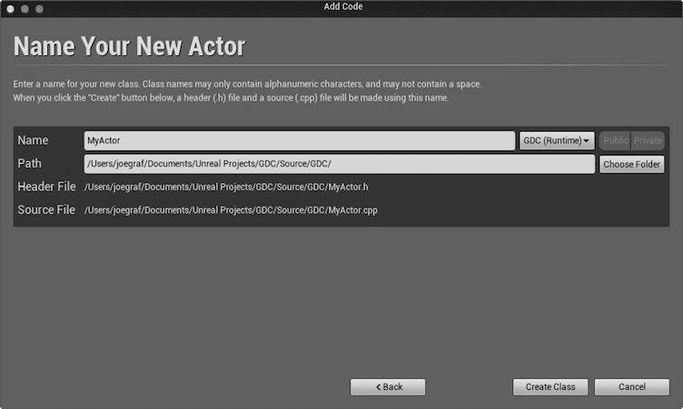

UE4完全投入c++的怀抱多少还是出乎意料的，毕竟现在讲究个快速开发，又因为App Store的审核机制使得脚本开发越发流行。很多人第一感觉用c++开发等同于开发慢，更新迭代更慢。为此，官方也用一篇博客解释了为什么。大体意思是使用了一些技术让c++具备了部分快速开发的能力，脚本未曾消失而是升华成更高级的可视化（Bluprint）编程了。


在UE4中用c++不难，可以把`unreal c++`看作加强版c++，它增加了很多特性让c++更易用。当然，本篇介绍肯定是针对具备编程语言使用经验的人群，毫无代码基础的，[Blueprint](https://docs.unrealengine.com/latest/INT/Engine/Blueprints/index.html)是更好的选择。

在UE4中写纯粹的老c++代码是可以的，但要完全利用起这款引擎，学习掌握unreal编程模型才是关键。


##C++与Blueprints

UE提供两种方法创建游戏性元素：**C++**和**Blueprints可视化脚本**。使用C++的话，程序员用代码添加基本的游戏性系统，设计师接着依此向关卡或游戏定制游戏逻辑。如此，C++程序员在IDE（Visual Studio，Xcode）中工作，设计师在Unreal编辑器的Blueprint编辑器中工作。


引擎提供的API和框架类两种方法均可独立利用，但要完全发挥实力最好是结合使用。意味着最正宗的引擎使用姿势是由程序员拿C++创建游戏逻辑功能块，由设计师摆弄这些功能块创造有趣的游戏逻辑。所以常规的工作流是C++程序员为设计师创建游戏逻辑功能块。此时，我们创建一个可以导出到Blueprint的类，在类中，添上设计师可以自由设置获取的属性即可。至于怎么导出与交互，简单，引擎提供成熟的工具和C++宏。


下面简单演示一下这个工作流


###类向导

- 首先就是**创建一个类**。使用编译器里的类向导可以生成基本的C++类，之后会把该类导出到Blueprint中。如图，我们创建一个类继承Actor：


- 然后填上类名，创建并生成代码文件： 


之后，（自动／手动）打开代码文件，里面已经有一些自动生成的类定义相关代码。通过向导创建类与其他IDE没啥区别，相信老司机已经做完前戏迫不及待想要啪啪啪（写代码）了。


自动生成的代码咱也先别急着删，弄懂了这些才算明白UE4的编程模型。咱既然是在学习使用工具，还是好好看看说明书的好。拿着锯子当刀使，你说你你蠢还是锯子不好用？


```cpp
#include "GameFramework/Actor.h"
#include "MyActor.generated.h"

UCLASS()
class AMyActor : public AActor
{
    GENERATED_BODY()

public: 
    // Sets default values for this actor's properties
    AMyActor();
    // Called when the game starts or when spawned
    virtual void BeginPlay() override;

    // Called every frame
    virtual void Tick( float DeltaSeconds ) override;
};
```