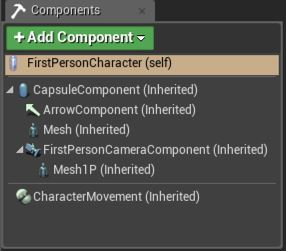
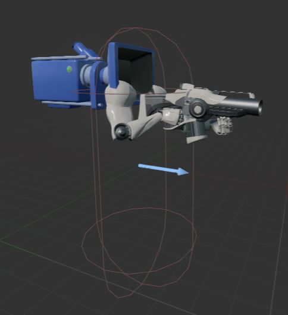

要在UE中玩转C++编程，首先就是通晓引擎提供的基础类。把握到UE的编程节奏，才可以灵活使用继承和组件来构造需要的游戏功能。

通常来讲，主要有4种与游戏性有关的类需要了解掌握，**`UObject, AActor, UActorComponent, UStruct`**。当然，你也可以创建与这些无关的类，只是不能利用引擎提供的特性罢了。一般不继承**UObject**创建的类多是第三方库，OS相关特性等等。

--------------------------------
##Unreal Objects (UObject)

UE里面最基本的结构就是**UObject**，与Cocos2d-x里的`CCNode`一个性质。它经常和**`UClass`**一起出现，提供一些最重要的基础服务：

- 属性与方法的反射（Reflection of properties and methods）
- 属性序列化（Serialization of properties）
- 垃圾回收（Garbage collection）
- 名字查找UObject（Finding UObjects by name）
- 属性可配置化（Configurable values for properties）
- 属性与方法的交流支持（Networking support for properties and methods）

所有源于UObject的类都自动创建了一个`UClass`单例，其中包含实例类中的所有元数据。UObject与UClass一起成为游戏逻辑对象生命周期的根节点。而UObject与UClass之间的区别在于，UClass描述了一个UObject实例的具体行为，比如哪些属性可以被序列化,交流传递等等。大多数游戏逻辑开发都不会直接继承UObject，而是转用AActor和UActorComponent。所以，写逻辑代码时不强求理解UClass/Uobject的工作原理，知道有这么个东西就行了。

----------------------------------------
##AActor

**AActor**是游戏体验中很重要的部分。各种AActor通过设计师或者游戏运行时创建在关卡中。所有能被放置在关卡总的对象均可继承自AActor类。比如`AStaticMeshActor`，`ACameraActor`，`APointLight`都是actor。AActor源于UObject，所以也能享受UObject带来的特性。AActor可以用代码（C++或者Blueprint）直接销毁，也可以在关卡销毁时自动垃圾回收（GC）。AActor可用于表现高级行为的游戏对象，也可作为数据复制传递时的基本类型。在复制传递过程中，AActor也能为其中任何需要传递的UActorComponent做信息分类。

AActor虽有自己的行为（继承），但更多的是作为各种`UActorComponent`的上层容器（组合）。AActor中的`RootComponent`成员变量负责组合，其中至少包含一个`UActorComponent`对象。AActor可被放置于关卡之前，至少必须包含一个**`USceneComponent`**对象，该对象负责AActor的移动、旋转和缩放。

AActor生命周期内会触发一系列的事件。最简单的有三种：

- BeginPlay － 对象首次在游戏中出现时触发
- Tick － 每帧触发
- EndPlay － 对象离开游戏时触发

> *更多关于AActor的细节，请参阅[文档](https://docs.unrealengine.com/latest/INT/Programming/UnrealArchitecture/Actors/index.html)*

----------------------------
###运行时生命周期

稍微讨论下AActor的生命周期。对于关卡中的actor，其生命周期从**加载并进入关卡直到关卡从内存中卸载而且actor被销毁**为止。而在运行时创建销毁的actor怎么算呢？UE把运行时创建AActor叫做**`spawning(播种)`**。种下一个actor比游戏中创建一个普通对象稍微复杂点。原因在于，一个AActor要正常运行在游戏中，需要注册到大量运行时系统中去，比如，它的初始位置初始角度要设置吧，物理系统需要注册吧，做tick通知的管理系统需要注册吧，等等等等。因此，专门有个方法用来播种actor，**`UWorld::SpawnActor()`**。一旦actor播种成功，立刻触发其`BeginPlay()`方法，下一帧就开始触发`Tick()`。

actor不再使用时，可以手动调用**`Destroy()`**进行销毁。也可以设置`Lifespan`成员变量来控制actor的存在时长，到时actor会自动调用`Destroy()`。销毁时，`EndPlay()`会被触发。

> *关于播种actor，请看[文档](https://docs.unrealengine.com/latest/INT/Programming/UnrealArchitecture/Actors/Spawning/index.html)查阅详情。*

------------------------------
##UActorComponent

**UActorComponent**有自己的行为，负责AActor某一项具体功能。比如提供网格效果、粒子特效、相机透视、物理交互等功能。AActor在游戏中分配高级目标之时，各个UActorComponent负责执行独立的任务协作达成该高级目标。组件可依附于其他组件上，也可成为AActor的根组件。一个组件只能依附一个父组件／Actor，可以有多个子组件，是个树状结构。子组件有相对父组件／Actor的位置、旋转、缩放属性。

Actor与Component有很多种用法。Actors-Component之间的关系可以描述成，Actor负责“这个东西是什么”，Component负责“这个东西是什么组成的”。

- RootComponent － AActor中的成员变量，actor组件树里的顶层组件
- Ticking － AActor执行Tick()时依次tick各个组件

-----------------------------------
###剖析第一人称角色

上面一直在文字解释，但一图胜千言，下面举个图例阐明AActor与UActorComponent之间的关系。我们基于`First Person Template`新建个工程。然后深入其Blueprint中，下图展示了**`FirstPersonCharacter`**这个Actor的**组件（Component）**树。`根组件（RootComponent）`是`CapsuleComponent`。依附在`CapsuleComponent`上的有`ArrowComponent`、`Mesh`、`FirstPersonCameraComponent`。叶子组件是依附于`FirstPersonCameraComponent`上的`Mesh1P`，表示第一人称的mesh与第一人称视角有关。

该组件树视觉化之后就长下图这样，除了`Mesh`组件，剩下所有组件都在3D空间内显示了出来。

组件树将附在某个actor类上。由此示例看出，**继承**与**组合**可以同时使用。想自定义一个已存在的AActor或UActorComponent时，就用继承；想让不同AActor共享某个功能时，就用组合。

-------------------------------------
##UStruct

使用**`UStruct`**不必继承其他类，只需在你的`struct`前标记一个**USTRUCT()**即可。由编译工具负责底层工作。与UObject不同，UStruct没有不受垃圾回收（GC）控制，需自己控制内存申请与销毁。简言之，UStruct是种原生普通的数据类型，但拥有与UObject一样的反射支持，所以可用于编辑器中编辑，Blueprint控制，序列化，网络传递等等。

----------------------------------
##总结

到此我们讨论了几个基础的游戏逻辑类，更多更全的内置类需要查阅[文档](https://docs.unrealengine.com/latest/INT/Programming/UnrealArchitecture/Reference/Classes/index.html)

- UObject - 引擎基类，提供反射、序列化、垃圾回收、网络传递等基本功能。一般不直接继承使用。
- AActor - 游戏体验中最重要的类，可用来表示游戏世界中任何实例。通常作为容器，与UActorComponent配合使用。
- UActorComponent - 各类功能组件，依附在AActor这个容器中，为其提供自己的功能。
- UStruct - 不支持垃圾回收，其他与UObject无二。

-------------------------------------------
##参阅

[Introduction to C++ Programming in UE4](https://docs.unrealengine.com/latest/INT/Programming/Introduction/index.html)