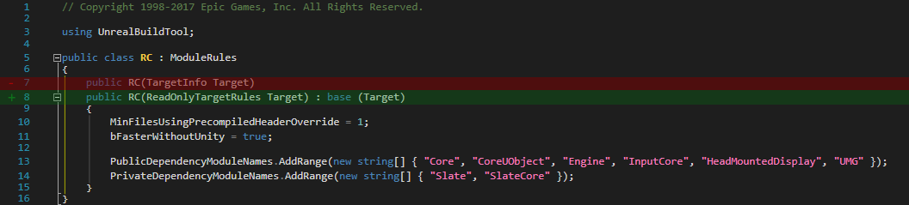
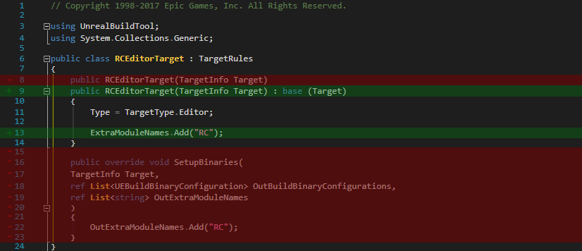
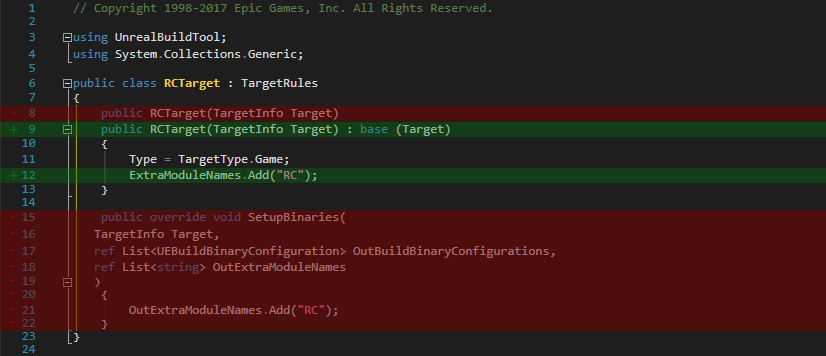

惊闻UE4已经到了4.20的版本了，心血来潮想着把自己的玩具项目（v4.16)升级一下。本以为只是右键项目工程文件，选择 `Switch Unreal Engine Version` 即可完事，结果还是报了错。

一番重试、重启、重装等骚操作后，老老实实的Google到了答案，原来是原工程里 build.cs 文件的 `SetupBinaries` 函数在新版不再支持了。参考[此链接](https://answers.unrealengine.com/questions/718575/error-when-updating-to-418-generating-visual-studi.html)，修改代码，重新生成，编译运行一气呵成。

对照修改工程下三个 build.cs 文件：

- YourProject\Source\YourProject\YourProject.Build.cs
- YourProject\Source\YourProject.Target.cs
- YourProject\Source\YourProjectEditor.Target.cs

